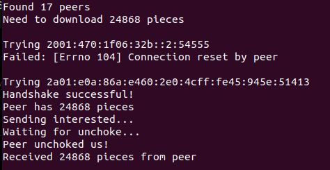
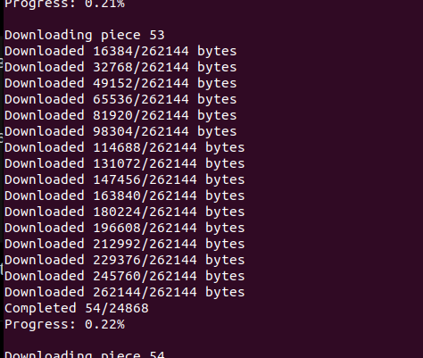

# BitTorrent From Scratch

A BitTorrent client built in Python from scratch to explore networking, distributed systems, and the BitTorrent protocol through hands-on implementation.

The project progresses from basic socket programming to communicating with real BitTorrent peers, exchanging protocol messages, downloading verified pieces, and reconstructing files.

## Features

* Torrent file parsing using custom bencode decoding
* SHA-1 info hash generation
* Tracker communication and peer discovery
* Peer-to-peer TCP connections
* BitTorrent handshake implementation
* Bitfield and `have` message parsing
* Interested/unchoke workflow
* Piece downloading using the peer wire protocol
* SHA-1 piece verification
* File reconstruction from downloaded pieces

## Project Structure

```text
learning/            Incremental implementations of each development phase
bittorrent-client/   Integrated BitTorrent client
```

The `learning` directory documents the progression of the project, with each phase focusing on a specific concept of the BitTorrent protocol. The final implementation combines these components into a functional BitTorrent client capable of communicating with real peers and downloading verified torrent data.

## Peer Discovery and Handshake

The client communicates with a tracker, discovers active peers, performs the BitTorrent handshake, and transitions into the interested/unchoked state required for data transfer.



## Piece Downloading

Pieces are requested in 16 KB blocks using the peer wire protocol. Downloaded pieces are verified against the SHA-1 hashes stored in the torrent metadata before being written to disk.



## Running the Client

```bash
cd bittorrent-client
python main.py
```

Update the torrent file path in `main.py` before execution.

## Future Improvements

* Multi-peer downloading
* Rarest-first piece selection
* Resume support
* Seeding support
* Magnet link support
* Distributed Hash Table (DHT)

## License

This project is licensed under the MIT License.
